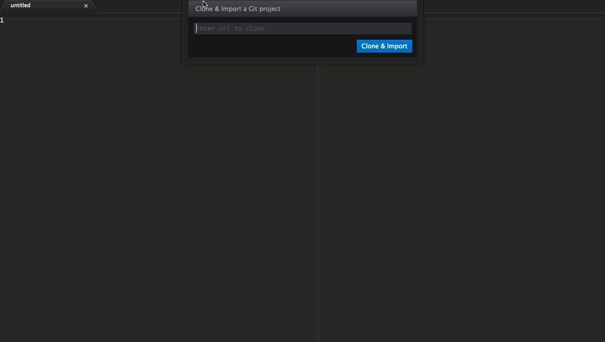

# Import

Git Clone and Import a project using <kbd>Ctrl</kbd>+<kbd>Shift</kbd>+<kbd>I</kbd> [Mac & Windows] or <kbd>Ctrl</kbd>+<kbd>I</kbd> [Linux]

Install: `apm install import`

Usage:
  1. On Mac & Windows, <kbd>Ctrl</kbd>+<kbd>Shift</kbd>+<kbd>I</kbd> to open the dialog
     On Linux, use <kbd>Ctrl</kbd>+<kbd>I</kbd>
  2. Enter the git repository to clone

Windows Users:
  Please ensure you have git installed and the `git` command is available on the `PATH`.

The project will be imported to the Atom Project Home. If the project is already existing in the Home folder, then it will be imported. Else, it will be `git clone`d and imported.

For existing projects inside Atom Project Home, just type in the folder name to import.

